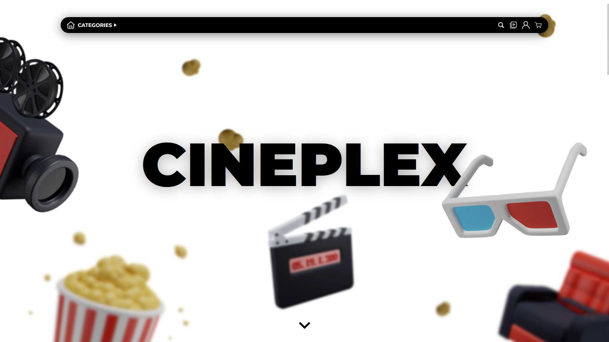

# CINEPLEX



CINEPLEX is a user-friendly platform that allows users to discover a world of movies effortlessly. Users can explore trailers, synopses, and more, browse by title or director, and dive into curated genres like action and drama. The platform provides detailed information about each film and offers a seamless shopping experience.

# Table of Contents
1. [CINEPLEX](#cineplex)
2. [Getting Started](#getting-started)
3. [Maintaining the Project](#maintaining-the-project)
4. [API](#api-1)
5. [License](#license)

## Getting Started

These instructions will get you a copy of the project up and running on your local machine for development and testing purposes.

### Prerequisites

- Docker
- Docker Compose

### Launching the Project

1. Clone the repository to your local machine.
```sh
git clone https://github.com/r-witz/CINEPLEX.git
```

2. Navigate to the project directory.
```sh
cd CINEPLEX
```

3. Run the following command to start the Docker containers:
```sh
docker compose up -d --build
```
> This will start the `php-website`, `php-api`, `db`, and `phpmyadmin` services.

4. Access the website entering the following URL:
```sh
http://localhost
```

### Setting Up the Database

1. Access phpMyAdmin at `http://localhost:8081`.
2. Import the [`init_db.sql`](./sql/init_db.sql) and [`insert_data.sql`](./sql/insert_data.sql) files.

> You can also reset the database by executing the [`reset.sql`](./sql/reset.sql) file.

## Maintaining the Project

These instructions will give you the basic knowledge about the project organisation, so you can maintain or understand it.

### File organisations

The project is divided into two main parts: the ``website`` and the ``api``.

- ### Website

    The ``website`` directory contains the front-end code of the project. It includes PHP files for different pages, actions, and shared components. It also includes the `styles` directory for CSS files and the `img` directory for images.

    - The `actions` directory contains all the files handling some actions and making calls to the api (eg. adding films to cart, buying films, loging in, disconnecting, searching, ...)
    - The `config` directory contains some Docker and Apache configurations files.
    - The `img` directory contains all the images the website needs, since they are **NOT** stored in the database, only their names is stored.
    - The `script` directory is used for storing javascript files, handling front-end features.
    - The `shared` directory is where the common .php files are stored (eg. header, footer, login, register, ...)
    - The `styles` directory contains all the .css files defining the style of each webpage.
    - The `video` directory is where is stored all the film trailers that you can watch after buying films.
    - We finally have some `.php` files that are our website pages. They are at the root of the website to avoid having extended urls with the folders names (eg. `http://localhost/src/cart.php`)

- ### API

    The ``api`` directory contains the back-end code of the project. It includes the `src` directory with PHP files for the API endpoints, controllers, and utilities. It also includes the `config` directory for Docker and Apache configuration files.

    - The `config` directory contains some Docker and Apache configurations files.
    - The `src` directory contains all the folders and files related to the code of the API.
        - The `controllers` directory contains the code for each of the API endpoints (eg. /film, /register, /login, /cart, /library, ...)
        - The `database` directory handles the connection to the database.
        - The `utils` directory contains some files utility like for exemple bcrypt for password encryption.
        - The `api.php` file handles the routing of each request to the controllers.

> To maintain the project, you should have a basic understanding of PHP, SQL, HTML, CSS, and Docker. You should also be familiar with the project structure and the codebase.

### Contributing GIT Guidelines

Contributors are encouraged to adhere to the following guidelines when contributing to the project.

Use Git for version control, and adhere to the commit message structure and branch naming conventions outlined in the [git conventional commits](https://www.conventionalcommits.org/en/v1.0.0/
). Here are some highlights about it :

**Commit Types:**

1. **feat:** Use for new features implemented.
2. **fix:** Use for bug fixes.
3. **refactor:** Use for code refactoring.
4. **docs:** Use for documentation updates.
5. **test:** Use for adding or modifying tests.
6. **chore:** Use for general maintenance or miscellaneous tasks.

Add "!" at the end of the keyword to denote a breaking change (e.g., `feat!`, `fix!`, etc.).

**Example Commit Messages:**

- feat!(graphics): Add new background image
- fix(network): Fix connection timeout issue
- docs(user): Update user manual for gameplay instructions
- test(utils): Add unit tests for utility function
- refactor(game): Refactor game logic for improved performance
- chore!(deps): Update dependencies to latest versions

### Database Schema

The database schema is defined in the `init_db.sql` file. It includes tables for `users`, `films`, `categories`, `actors`, `directors`, and `orders`.


> This database Scheme is representing how the database is made

## API

The API of CINEPLEX is designed to handle various requests related to user authentication, film management, shopping cart functionality, and more. Below are the available endpoints and their corresponding functionalities:

- **GET /**: 
  - Retrieves a simple greeting message, indicating that the API is running.

- **POST /login**:
  - Handles user authentication by allowing users to log in with their credentials.
  - Takes informations in the body (email, password)
  - Return a message indicating if the login is successfull or has failed

- **POST /register**:
  - Registers a new user by creating an account with the provided information.
  - Takes informations in the body (pseudo, email, password)
  - Return a message indicating if the register is successfull or has failed

- **GET /library**:
  - Retrieves the films available in the user's library.
  - Takes informations in the body (user_email)
  - Return a list of film in library (each film has these elements : id, title, plot, image_name, director_name, actor_names, categories, price)

- **POST /library**:
  - Adds selected films to the user's library.
  - Takes informations in the body (user_email)
  - Return a message indicating if adding the film to the library is successfull or has failed

- **POST /cart**:
  - Adds films to the user's shopping cart.
  - Takes informations in the body (user_email, film_id)
  - Return a message indicating if adding the film to the cart is successfull or has failed 

- **DELETE /cart**:
  - Removes films from the user's shopping cart.
  - Takes informations in the body (user_email, film_id)
  - Return a message indicating if removing the film to the cart is successfull or has failed

- **GET /cart**:
  - Retrieves the contents of the user's shopping cart.
  - Takes informations in the body (user_email)
  - Return a list of film in cart (each film has these elements : id, title, plot, image_name, director_name, actor_names, categories, price)

- **GET /film**:
  - Retrieves information about specific films, allowing users to browse and view details.
  - Takes informations as querry params (search)
  - Return a list of film matching the search (each film has these elements : id, title, plot, image_name, director_name, actor_names, categories, price)

- **GET /people**:
  - Retrieves information about actors, directors, or any other relevant individuals involved in filmmaking.
  - Takes informations as querry params (search)
  - Return a list of film matching people (people has these elements : name, image_name)

Please note that the API responses are in JSON format, and appropriate HTTP status codes are returned to indicate the success or failure of each request.

For detailed usage examples and request payloads, refer to the API documentation or explore the source code of the API controllers.

## License

This project is licensed under the GNU General Public License. For more details, see the [`LICENSE`]( "./LICENSE") file.